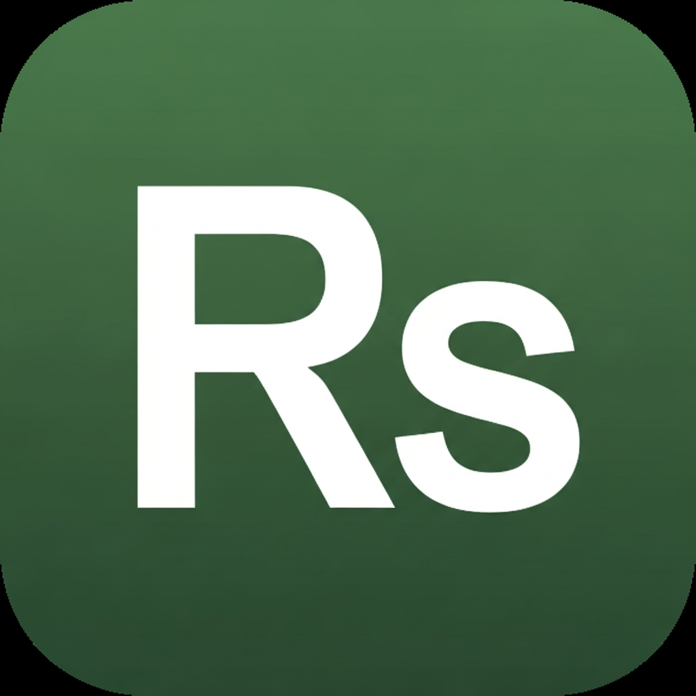

# 🇵🇰 Tax Helper — Pakistan FBR Tax Calculator

<div align="center">
  

  <h3>Pakistan Income Tax Estimator · Tax Year 2024–25</h3>

  <p>
    A <strong>free, offline-first mobile app</strong> built with React Native (Expo) that helps Pakistani citizens calculate their income tax estimate based on FBR (Federal Board of Revenue) rules — in under 2 minutes.
  </p>

  <p>
    
    
    
    
    
  </p>
</div>

---

> ⚠️ **Demo Project Notice**  
> This is a demo / portfolio project. While the tax logic is based on publicly available FBR rates for Tax Year 2024–25, it is **not a substitute for professional tax advice**. Always consult a certified tax consultant or file at [iris.fbr.gov.pk](https://iris.fbr.gov.pk) for your official return.

---

## ✨ Features

| Feature | Details |
|---|---|
| 🧙 5-Step Wizard | Personal info → Family → Profession → Income → Results |
| 📊 Accurate Slab Calculation | FBR 2024–25 salaried & non-salaried tax brackets |
| 💻 IT Freelancer Rate | 0.25% final tax (SRO 586(I)/2023) |
| 🌾 Agriculture Exemption | Federal agricultural income tax exemption (Section 41) |
| 👩‍⚖️ Widow 50% Relief | Auto-applied under Clause 1(A), Second Schedule |
| 🏛️ Government Employee | Pension exemption (Clause 13, Second Schedule) |
| 📖 Plain-Language Laws | Explains each applicable FBR law in simple Urdu-English |
| 📱 Cross-Platform | Runs on iOS, Android, and Web |

---

## 📸 App Screens

The app guides users through a 5-step wizard:

1. **Personal Info** — Name, age, gender
2. **Family Status** — Marital status, widow status, children
3. **Profession** — Choose from 10 profession categories
4. **Income** — Annual or monthly input
5. **Results** — Full tax breakdown with applicable laws

---

## 🗂️ Project Structure

```
Tax-Assistant-Pro/
├── artifacts/
│   ├── mobile/               # 📱 React Native / Expo app (main app)
│   │   ├── app/              # Expo Router pages
│   │   │   ├── (tabs)/       # Home & Tax Brackets tabs
│   │   │   └── wizard/       # 5-step wizard screens
│   │   ├── components/       # Reusable UI components
│   │   ├── constants/
│   │   │   ├── taxData.ts    # All FBR tax logic & brackets
│   │   │   └── colors.ts     # Design tokens
│   │   ├── context/
│   │   │   └── WizardContext.tsx  # Global wizard state
│   │   └── hooks/
│   ├── api-server/           # Express 5 backend (health check scaffold)
│   ├── mockup-sandbox/       # UI mockup preview tool
│   └── tax-helper-video/     # Promo/demo web app
├── lib/
│   ├── db/                   # Drizzle ORM + PostgreSQL schema
│   ├── api-spec/             # OpenAPI spec
│   ├── api-client-react/     # Generated React Query hooks
│   └── api-zod/              # Generated Zod validation schemas
└── scripts/                  # Workspace utility scripts
```

---

## 🚀 Getting Started (Windows Setup Guide)

Since Node.js and `pnpm` are not yet installed on your system, follow these steps to set up the environment and run the app.

### 1. Install Node.js
Choose **one** of the following ways to install Node.js (Version 20+ LTS recommended):

* **Option A (Fastest via Terminal):**
  Open PowerShell as Administrator and run:
  ```powershell
  winget install OpenJS.NodeJS.LTS
  ```
  *(Restart your terminal after installation so the paths update).*
  
* **Option B (Direct Download):**
  Download and run the installer from the official website: [nodejs.org](https://nodejs.org/)

### 2. Install pnpm (Package Manager)
Once Node.js is installed, open a new terminal window and run:
```powershell
npm install -g pnpm
```

### 3. Install App Dependencies
Navigate to your project directory and install the packages:
```powershell
pnpm install
```

### 4. Start the Mobile App
Run the development server for the mobile app:
```powershell
pnpm --filter @workspace/mobile dev
```
Press `w` in your terminal to open it in your browser, or install the free **Expo Go** app on your phone and scan the QR code displayed in the terminal.

---

### 💻 Running the API Backend (Optional)
To run the database and backend server:
```powershell
pnpm --filter @workspace/api-server dev
```
*Note: Requires a PostgreSQL database URL set in your environment variables.*

---

## 🧮 Tax Logic

All tax calculations live in [`artifacts/mobile/constants/taxData.ts`](artifacts/mobile/constants/taxData.ts).

### Salaried Person Slabs (FBR 2024–25)

| Annual Income (PKR) | Tax Rate |
|---|---|
| 0 – 6,00,000 | 0% |
| 6,00,001 – 12,00,000 | 5% |
| 12,00,001 – 22,00,000 | 15% + ₨30,000 |
| 22,00,001 – 32,00,000 | 25% + ₨1,80,000 |
| 32,00,001 – 41,00,000 | 30% + ₨4,30,000 |
| 41,00,001+ | 35% + ₨7,00,000 |

### Special Cases

- **IT Freelancers** (foreign clients): Flat **0.25%** final tax
- **Agricultural income**: **Federal tax exempt** (Section 41)
- **Widows**: **50% rebate** on computed tax

---

## 🛠️ Tech Stack

| Layer | Technology |
|---|---|
| Mobile App | React Native, Expo SDK 54, Expo Router |
| Language | TypeScript 5.9 |
| State Management | React Context API |
| UI | Custom StyleSheet, Inter font |
| Package Manager | pnpm workspaces |
| Backend (scaffold) | Express 5, Node.js 24 |
| Database (scaffold) | PostgreSQL + Drizzle ORM |
| Validation | Zod v4 |
| API Codegen | Orval (from OpenAPI spec) |

---

## 🤝 Contributing

Contributions are welcome! See [`contributing.md`](contributing%20.md) for guidelines.

1. Fork the repo
2. Create your feature branch (`git checkout -b feature/your-feature`)
3. Commit your changes (`git commit -m 'Add some feature'`)
4. Push to the branch (`git push origin feature/your-feature`)
5. Open a Pull Request

---

## 📋 Useful Commands

```bash
pnpm run typecheck                         # Full TypeScript typecheck
pnpm run build                             # Typecheck + build all packages
pnpm --filter @workspace/api-spec run codegen   # Regenerate API hooks from OpenAPI
pnpm --filter @workspace/db run push       # Push DB schema (dev only)
```

---

## ⚖️ Disclaimer

This app is for **estimation purposes only** based on publicly available FBR rates. Tax laws change annually. For accurate filing, consult a professional tax advisor or use the official [FBR IRIS portal](https://iris.fbr.gov.pk).

---

## 📄 License

MIT — see [LICENSE](LICENSE) for details.

---

<div align="center">
  Built with ❤️ for Pakistani taxpayers · <a href="https://iris.fbr.gov.pk">File at iris.fbr.gov.pk</a>
</div>
